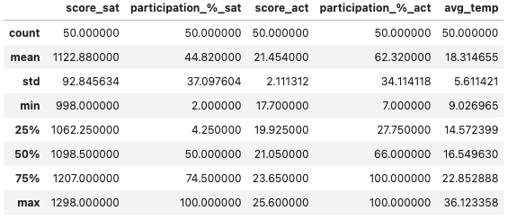
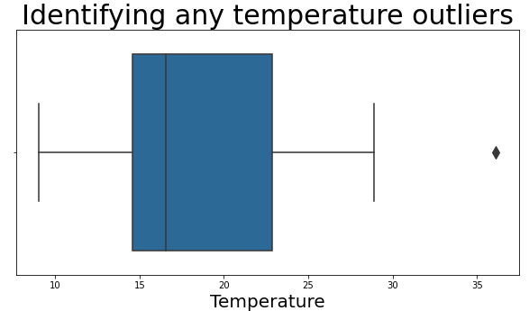
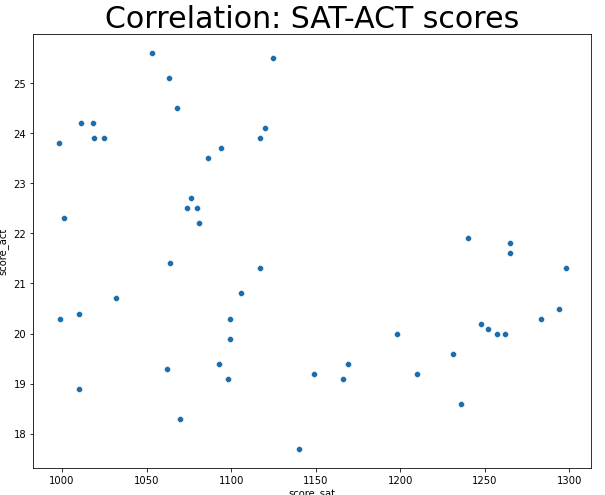
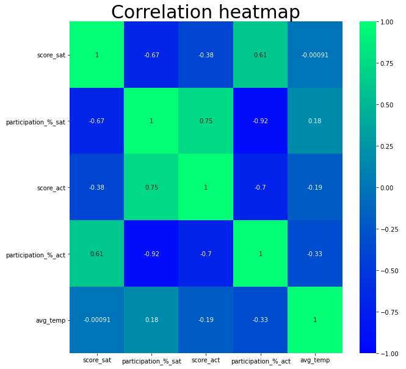

# Project 1
---
# Correlation between US State temperatures and SAT and ACT participation rates and scores

## Context
There is some evidence, that cold countries (with an average yearly temperature of 10 degrees Celsius or less) are more developed,richer, and have better education systems than hot nations. 

## Problem statement
In this project, I want to study if there is any evidence of a relation between US State temperatures and their SAT and ACT participation rates and scores.

---
## Description of data
Next, I will describe the datasets used for this study:

1. [`act_2018.csv`](./data/act_2018.csv)([source](https://blog.prepscholar.com/act-scores-by-state-averages-highs-and-lows)):
This dataset cointains information about the 2018 ACT Scores by State. It has 52 rows and 3 columns.

| Feature       | Type   | Description                 |
|---------------|--------|-----------------------------|
| State         | string | Name of US State            |   
| Participation | string | Participation rate          |   
| Composite     | float  | Score composite of ACT test |  

2. [`sat_2018.csv`](./data/sat_2018.csv)([source](https://blog.collegevine.com/here-are-the-average-sat-scores-by-state/)):
This dataset cointains information about the 2018 SAT Scores by State. I has 51 rows and 5 columns.

| Feature                            | Type   | Description                    |
|------------------------------------|--------|--------------------------------|
| State                              | string | Name of US State               |
| Participation                      | string | Participation rate             |
| Evidence-Based Reading and Writing | float  | Score of EBRW part of SAT test |
| Math                               | float  | Score of Math part of SAT test |
| Total                              | float  | Total SAT score                |

3. [`climate_by_state_2018-HBA-Copy.csv`](./data/climate_by_state_2018-HBA-Copy.csv)([source](https://www.kaggle.com/jmcslk/2018-quarterly-us-weather-data-by-state)):
This dataset contains information about the 2018 quarterly weather conditions. It has 50 rows and 18 columns.

| Feature           | Type   | Description                         |
|-------------------|--------|-------------------------------------|
| state             | string | Name of US State                    |
| avg_hum_spr       | float  | Average humidity during spring      |
| avg_hum_sum       | float  | Average humidity during summer      |
| avg_hum_fall      | float  | Average humidity during fall        |
| avg_hum_wint      | float  | Average humidity during winter      |
| avg_temp_spr      | float  | Average temperature during spring   |
| avg_temp_sum      | float  | Average temperature during summer   |
| avg_temp_fall     | float  | Average temperature during fall     |
| avg_temp_wint     | float  | Average temperature during winter   |
| avg_precip_spr    | float  | Average precipitation during spring |
| avg_precip_sum    | float  | Average precipitation during summer |
| avg_precip_fall   | float  | Average precipitation during fall   |
| avg_precip_wint   | float  | Average precipitation during winter |
| avg_pressure_spr  | float  | Average pressure during spring      |
| avg_pressure_sum  | float  | Average pressure during summer      |
| avg_pressure_fall | float  | Average pressure during fall        |
| avg_pressure_wint | float  | Average pressure during winter      |

4. [`act.csv`](./data/act.csv)
This dataset was created by cleaning the [`act_2018.csv`](./data/act_2018.csv) dataset. It has 51 rows and 4 columns.

| Feature         | Type   | Description              |
|-----------------|--------|--------------------------|
| state           | string | Name os US State         |
| composite       | float  | Score composite (ACT)    |
| participation_% | float  | Participation rate (ACT) |

5. [`sat.csv`](./data/sat.csv)
This dataset was created by cleaning the [`sat_2018.csv`](./data/sat_2018.csv) dataset. It has 51 rows and 4 columns.

| Feature         | Type   | Description              |
|-----------------|--------|--------------------------|
| state           | string | Name os US State         |
| total           | float  | Total score (SAT)        |
| participation_% | float  | Participation rate (SAT) |

6. [`climate.csv`](./data/climate.csv)
This dataset was created by cleaning the [`climate_by_state_2018-HBA-Copy.csv`](./data/climate_by_state_2018-HBA-Copy.csv) dataset. It has 51 rows and 3 columns.

| Feature  | Type   | Description                      |
|----------|--------|----------------------------------|
| state    | string | Name os US State                 |
| avg_temp | float  | Average State yearly temperature |

7. [`act_GOOD.csv`](./data/act_GOOD.csv)
This dataset was created by editing the [`act.csv`](./data/act.csv) dataset. It has 50 rows and 5 columns.

Data dictionary: same as [`act.csv`](./data/act.csv)

8. [`sat_GOOD.csv`](./data/sat_GOOD.csv)
This dataset was created by editing the [`sat.csv`](./data/sat.csv) dataset. It has 50 rows and 5 columns.

Data dictionary: same as [`sat.csv`](./data/sat.csv)

9. [`all_in_one.csv`](./data/all_in_one.csv)
This dataset was created by combining columns of these datasets: [`climate.csv`](./data/climate.csv), [`act_GOOD.csv`](./data/act_GOOD.csv), [`sat_GOOD.csv`](./data/sat_GOOD.csv). It has 50 rows and 6 columns.

| Feature             | Type   | Description                     |
|---------------------|--------|---------------------------------|
| state               | string | Name os US State                |
| score_sat           | float  | Total score (SAT)               |
| participation_%_sat | float  | Participation rate (SAT)        |
| score_act           | float  | Composite score (ACT)           |
| participation_%_act | float  | Participation rate (ACT)        |
| avg_temp            | float  | Average temperature of US State |

---
## Data Analysis

1. **Data cleaning and preparation:**
First, to go from [`act_2018.csv`](./data/act_2018.csv), [`sat_2018.csv`](./data/sat_2018.csv) and [`climate_by_state_2018-HBA-Copy.csv`] to [`act.csv`](./data/act.csv), [`sat.csv`](./data/sat.csv) and [`climate.csv`](./data/climate.csv) :

    - Checked for missing values
    - Checked for obvious data error in the dataset
    - Edited column names
    - Created new column with total or composite score as floats
    - Deleted unnecessary columns
    - Changed names in the 'state' column so every dataset would have the same format
    - Sorted the Sate names alphabetically

Then, to go from prior datasets metioned to [`act_GOOD.csv`](./data/act_GOOD.csv) and [`sat_GOOD.csv`](./data/sat_GOOD.csv) :

    - Created a function to identify missing value/row in the [`climate.csv`](./data/climate.csv) dataset
    - Deleted the correspondent row from [`act.csv`](./data/act.csv) and [`sat.csv`](./data/sat.csv) to match the shape of [`climate.csv`](./data/climate.csv)
    
Last but not least, I created [`all_in_one.csv`](./data/all_in_one.csv) from combining [`act_GOOD.csv`](./data/act_GOOD.csv), [`sat_GOOD.csv`](./data/sat_GOOD.csv) and [`climate.csv`](./data/climate.csv) by:

    - Adding the necessary columns of each dataset to conduct the sudy
    - Renaming the columns to more indicative names
    
2. **EDA and visualization:**
In this section, the data will be analyzed to study the correlation between US State temperatures and ACT and SAT participation rates and scores.

First, I conducted some summary statistics to scan for some significant insight I may find.

Some interesting observations would be:
    - ACT mean perticipation is 17.5% higher
    - STD is similar for both test scores
    - Max. and min. scores are within their boundaries.
    
Then, I looked into the temperature data by doing a boxplot and searching for some significant insight.

As shown, there is one outlier: the State of Maine with an average temperature of 36 degrees Celcius.

Next, I study the correlation between US State temperatures, participation rates and scores. To do so, one of the better graphs to display this type of problem is the heatmap or scatterplot. Below, I display one of the scatterplots of my study, where a lack of trend and correlation between SAT and ACT scores is found.

After obtaining my first results, I selected the warmest and coldest US States to see if any new significant insights were found. Below, a heatmap of the results is displayed.

---  
## Findings

The most intersting insights obtained by the results of the study are:

    - The scores of both tests are very weakly correlated
    - The participation rate and score of each individual test are strongly negatively correlated
    - The average temperatures are practically not correlated at all neither with the participation rates nor the scores of both tests

## Conclusion

In conclusion, and to answer the question of US State temperatures affecting SAT and ACT participation rates and scores, I have to say that after my study I have found no evidence of this being the case.